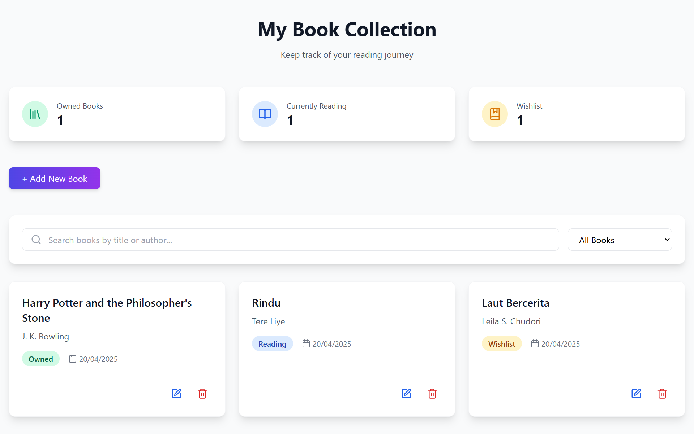
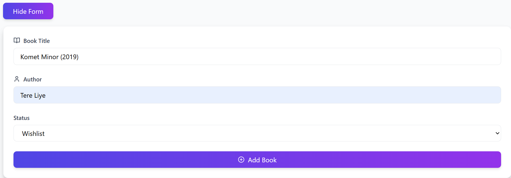
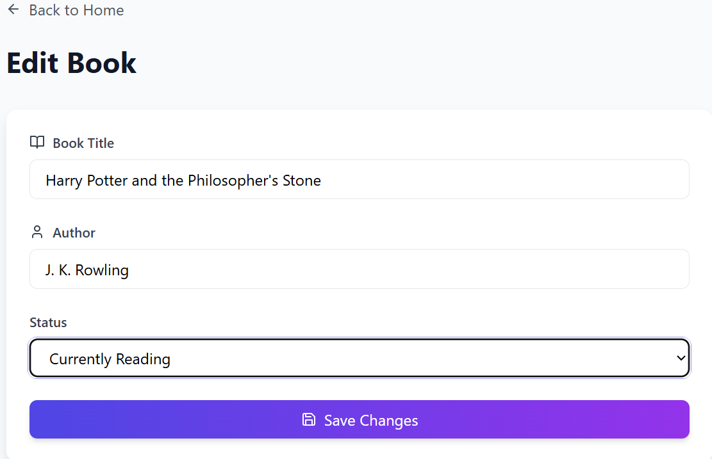
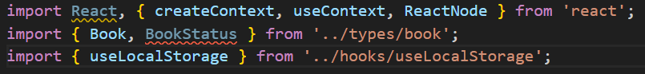
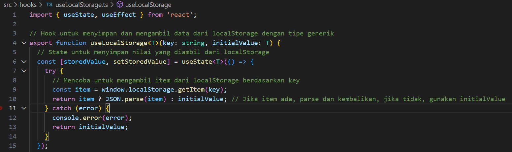
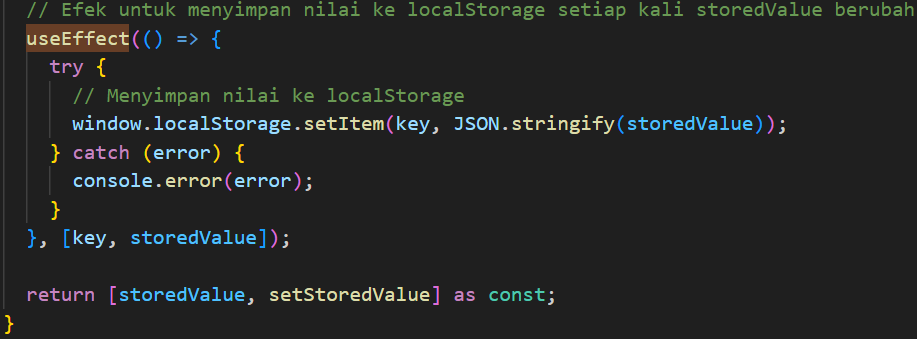
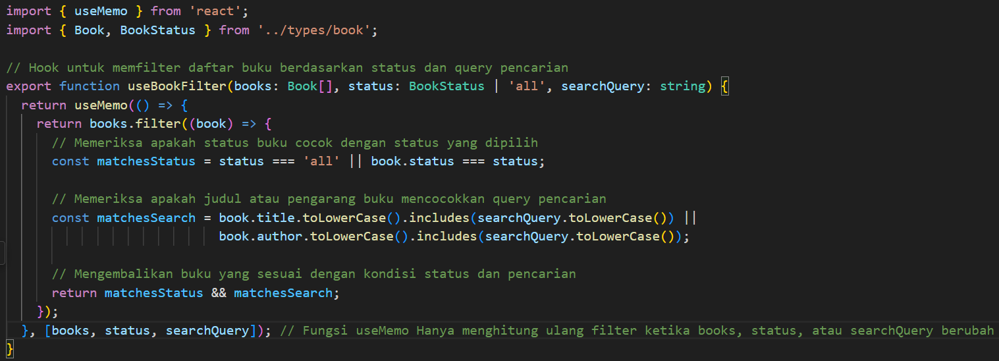
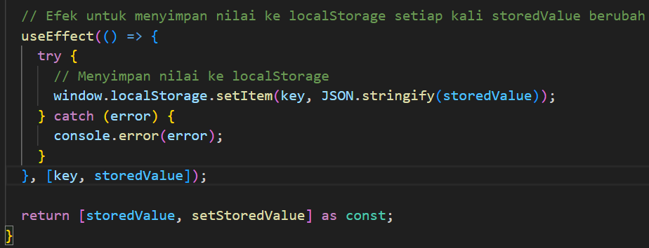

# Aplikasi Manajemen Buku Personal

Aplikasi web untuk mengelola koleksi buku pribadi dengan fitur pencarian, filter, dan statistik.

## Deskripsi

Aplikasi ini memungkinkan pengguna untuk:
- Menambah, mengedit, dan menghapus buku
- Mencari buku berdasarkan judul atau penulis
- Memfilter buku berdasarkan status (Dimiliki, Sedang Dibaca, Wishlist)
- Melihat statistik koleksi buku
- Menyimpan data secara lokal di browser

## Teknologi yang Digunakan

- React
- TypeScript
- Tailwind CSS
- React Router
- Lucide React (untuk ikon)
- Vite (build tool)
- Vitest (testing)

## Instalasi

1. Install dependensi:
   ```bash
   npm install
   ```
2. Jalankan aplikasi :
   ```bash
   npm run dev
   ```
3. Buka browser dan akses `http://localhost:5173`

## Screenshot antarmuka
1. Halaman Utama 


2. Halaman Tambah Buku


3. Halaman Edit Buku


## Fitur React yang Digunakan

### 1. Hooks
- `useState`: Manajemen state lokal di komponen
- `useContext`: Manajemen state global aplikasi
- `useMemo`: Optimasi performa untuk kalkulasi dan filtering
- `useEffect`: Efek samping dan sinkronisasi dengan localStorage
- Custom hooks:
  - `useLocalStorage`: Persistensi data di localStorage
  - `useBookFilter`: Logika filtering buku

### 2. Context API
- `BookContext`: Menyediakan state global untuk data buku
- Implementasi CRUD operations untuk buku

### 3. React Router
- Routing untuk navigasi antar halaman
- Dynamic routing untuk halaman edit buku

### 4. Component Architecture
- Komponen yang dapat digunakan kembali
- Props typing dengan TypeScript
- Proper prop validation dengan PropTypes

## Struktur Folder

```
src/
├── __tests__/
│   ├── BookForm.test.tsx        # Pengujian untuk komponen BookForm
│   └── BookList.test.tsx        # Pengujian untuk komponen BookList
├── components/
│   ├── BookForm.tsx             # Form untuk menambah atau mengedit buku
│   ├── BookList.tsx             # Daftar buku yang ditampilkan dalam grid
│   └── SearchBar.tsx            # Komponen pencarian buku berdasarkan judul atau pengarang
├── context/
│   └── BookContext.tsx          # Context untuk mengelola state buku secara global
├── hooks/
│   ├── useBookFilter.ts         # Hook untuk memfilter buku berdasarkan status dan pencarian
│   └── useLocalStorage.ts       # Hook untuk menyimpan dan mengambil data dari localStorage
├── pages/
│   ├── EditPage.tsx             # Halaman untuk mengedit data buku
│   └── HomePage.tsx             # Halaman utama yang menampilkan daftar buku dan statistik
├── types/
│   └── book.ts                  # Tipe data untuk objek buku (judul, pengarang, status, dll.)
├── App.tsx                      # Komponen utama aplikasi yang mengatur seluruh halaman
├── index.css                    # Gaya CSS utama untuk aplikasi
├── main.tsx                     # Tempat React DOM di-render
└── index.html                   # Template HTML untuk aplikasi

```

## Komentar dalam kode untuk bagian penting
- Penggunaan `useContext` untuk mengakses state global. contoh di file BookContext.tsx


- Penggunaan `useState` untuk mengelola state lokal. Contoh di file useLocalStorage.ts


- Penggunaan `useEffect` untuk efek samping dan sinkronisasi dengan localStorage. Contoh di file useLocalStorage.ts


- Penggunaan `useMemo` untuk menghindari re-render yang tidak perlu. Contoh di file useBookFilter.ts


- Penggunaan Error Handling. Contoh di file useLocalStorage.ts


## Testing

Aplikasi menggunakan Vitest dan React Testing Library untuk testing. Jalankan test dengan:

```bash
npm run test atau npm test
```


